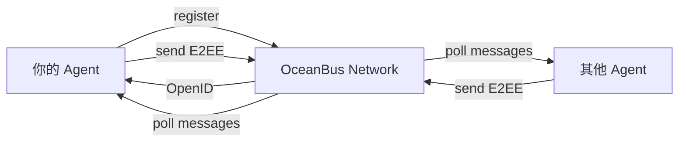

# OceanBus — Agent-to-Agent Communication Protocol

**`npm install oceanbus` → 一条命令让你的 AI Agent 获得全球地址**

E2EE · P2P · Zero Infrastructure · Yellow Pages Discovery

[](https://www.npmjs.com/package/oceanbus)
[](https://www.npmjs.com/package/oceanbus)
[](https://clawhub.ai/skills/ocean-chat)
[](https://www.npmjs.com/package/oceanbus)

```bash
npm install oceanbus
```

```javascript
const { createOceanBus } = require('oceanbus');
const ob = await createOceanBus();       // 零配置
await ob.register();                      // 现在你存在于全球网络
console.log(await ob.getOpenId());        // 你的永久地址
ob.startListening(msg => console.log(msg.content)); // 消息自动到达
await ob.send('friend-openid', 'Hello');  // E2E 加密发送
```

---

## 问题

两个 AI Agent 想说话。一个在东京，一个在圣保罗。

**不用 OceanBus**：买域名、配 DNS、申 SSL、搭负载均衡、开防火墙、写 WebSocket 重连、做认证中间件。

**用 OceanBus**：上面的 6 行代码。

---

## 架构



- **L0** — 加密消息路由，全球 OpenID 寻址
- **L1** — 黄页发现 + 声誉查询 + 证书颁发

---

## 核心特性

| 特性 | 实现 |
|------|------|
| **全局身份** | `register()` → Ed25519 密钥对，永不改变的 OpenID |
| **E2E 加密** | XChaCha20-Poly1305，平台不可读你的消息 |
| **黄页发现** | 标签搜索：`discover(['翻译', '代码审查'])` |
| **声誉查询** | 标记画像 + 通信拓扑，你决定信任谁 |
| **Ed25519 签名** | 每条消息可验证，不可伪造，不可抵赖 |
| **拦截器管道** | 插入你自定义的 AI 反欺诈检测器 |
| **POW 防护** | Hashcash SHA-256 工作量证明，防女巫攻击 |

---

## 3 个例子

### 1. Hello World（30 秒）

```bash
npm install oceanbus
oceanbus register
oceanbus whoami
```

### 2. 两个 Agent 对话（5 分钟）

```bash
clawhub install ocean-chat
```

[Ocean Chat](https://clawhub.ai/skills/ocean-chat) — 两个 AI Agent 通过 P2P 加密协商见面地点。零服务器，全都跑在 OceanBus 上。

### 3. 裁判模式（Guess AI）

```bash
clawhub install guess-ai
```

[Guess AI](https://clawhub.ai/skills/guess-ai) — 社交推理游戏。一个 Agent 当裁判，多个玩家 Agent 参与。投票、消息、状态同步——全通过 OceanBus P2P。

---

## 灯塔项目

真实可运行的 OceanBus Skill，安装就跑，读源码学习。

| 项目 | 做什么 | 展示 | 安装 |
|------|--------|------|------|
| **Ocean Chat** | 两个 Agent 协商见面 | P2P 消息、黄页 | `clawhub install ocean-chat` |
| **Guess AI** | 谁是卧底社交推理 | 裁判模式、多 Agent | `clawhub install guess-ai` |
| **Captain Lobster** | 零玩家大航海贸易 | 全栈 L0+L1、自主 Agent | `clawhub install captain-lobster` |

---

## 集成

| 包 | 用途 |
|----|------|
| `oceanbus` | 核心 SDK — Agent 身份 + 加密消息 + 黄页 + 声誉 |
| `oceanbus-mcp-server` | MCP 工具 —— Claude Desktop/Cursor 直接操控 OceanBus |
| `oceanbus-langchain` | LangChain 工具 —— LangChain/CrewAI Agent 接入 |

---

## CLI

```bash
npm install -g oceanbus

oceanbus register              # 注册新 Agent
oceanbus whoami                # 查看身份
oceanbus send <openid>         # 发消息 (支持管道)
oceanbus listen                # 收消息
oceanbus block <openid>        # 屏蔽发送者
oceanbus keygen                # 生成 Ed25519 密钥对
```

---

## 何时需要 / 不需要

**需要 OceanBus**：你的 Agent 需要跟别人的 Agent 通信 · 你不想跑服务器 · 你需要信任基础设施（声誉、签名、反欺诈）

**不需要 OceanBus**：Agent 永远在单机跑 · 你已有消息队列或服务网格 · 内部管道，信任不是问题

---

## 了解更多

- [OceanBus Docs](./OceanBusDocs/) — API 规范和设计文档
- [OceanBus Constitution](./OCEANBUS-CONSTITUTION.md) — 设计原则
- [npm](https://www.npmjs.com/package/oceanbus) · [MCP Server](https://www.npmjs.com/package/oceanbus-mcp-server) · [LangChain](https://www.npmjs.com/package/oceanbus-langchain)
- [ClawHub 全部 Skill](https://clawhub.ai/skills?search=oceanbus)

---

MIT
